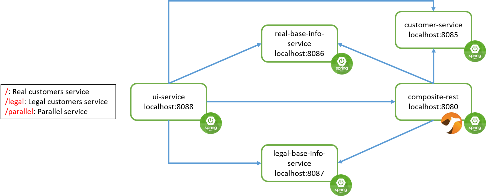

# Spring Boot + Spring Data + Apache Camel (Service Composition Example)

This is a simple example to show you how to implement a composite service from simple services usign Apache Camel

# Libraries and Tools
* [Module] [`Spring Boot`](https://spring.io/projects/spring-boot)
* [Module] `Spring Data`
* [Library] [`Apache Camel`](https://camel.apache.org/)
* [Library for converting object to/from json] [`Google Gson`] (https://github.com/google/gson)
* [Library for auto-generating getters, setters, constructors and others] [`Lombok`](https://projectlombok.org/)
* [Library] `Thymeleaf`
* [Database] `H2`

# How it works

This is a simple banking business flow. There is two simple services `Customer` and `Base Info`. 
Each customer has a one-to-one relationship with base info which stores it's first name and last name.
Each of these services is implemented as a `Spring Boot` application and simply on different ports. 
A composite service has been implemented to combine these two services as a single one using `Apache Camel`.
Additionally, for simple testing another service has been implemented too which is a UI module and
is responsible to interact with all the other three services.

# How to run
* Start `customer-service` module. It can be verified using url [http://localhost:8085/customers](http://localhost:8085/customers).
* Start `base-info-service` module. It can be verified using url [http://localhost:8086/baseinfos](http://localhost:8086/baseinfos).
* Start `composite-rest` module. It can be verified using url [http://localhost:8080/customerBaseInfos?cid=1](http://localhost:8080/customerBaseInfos?cid=1).
* Start `ui-service` module and look at [http://localhost:8088/](http://localhost:8088/) to view all the three services.
